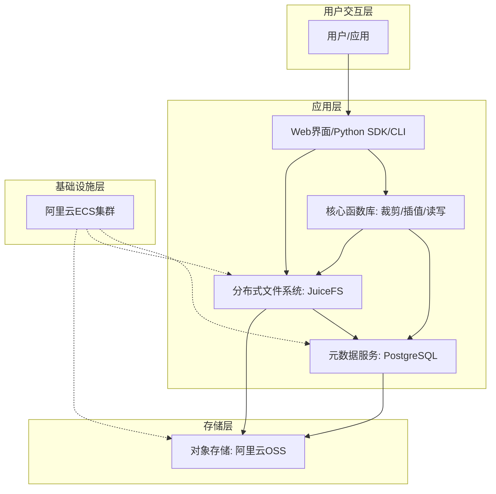

# 面向地球系统科学的海量网格类数据的分布式文件系统

本项目是为2025年度中国青年科技创新“揭榜挂帅”擂台赛（CQ-16赛题）设计的解决方案，旨在解决地球系统科学领域中海量网格类数据（如HDF5、GRIB）管理和访问的挑战。

## 1. 项目背景与痛点

随着观测技术和数值模拟精度的提升，地球系统科学中的网格数据规模正以PB级速度增长，传统文件系统和数据处理方法面临严峻挑战：

- **I/O瓶颈**: 传统分布式文件系统（如HDFS）将文件视为字节流，对于HDF5这类内嵌复杂结构的数据格式，读取局部数据（如单个变量或一个时空切片）往往需要解析整个文件，导致巨大的I/O开销和访问延迟。
- **元数据缺失**: 文件系统仅管理文件级元数据（如路径、大小），无法感知文件内部的科学元数据（如变量名、坐标系、物理单位、维度信息），导致无法按“语义”进行数据检索。
- **工具链分散**: 科研人员需要在不同的工具（如Python的h5py库、Shell命令）和环境之间切换，增加了数据处理的复杂性和维护成本。

## 2. 解决方案：融合语义的分布式文件系统

为解决上述痛点，我们设计并实现了一套创新的分布式文件系统方案。本系统**以开源文件系统JuiceFS为底座，创造性地引入PostgreSQL作为二级元数据引擎**，实现了对科学数据内部结构的深度解析和索引，将传统的文件级管理提升至**字段级(Field-level)**和**块级(Chunk-level)**管理。

### 核心理念

**数据与元数据分离，语义与物理映射结合**。

- **数据层**: 原始的HDF5等文件存储在阿里云OSS等高可用、可扩展的对象存储上，由JuiceFS负责管理数据块和提供POSIX兼容的访问接口。
- **元数据层**:
  - **一级元数据 (JuiceFS)**: 文件名、权限、大小等基本信息，由JuiceFS自身管理。
  - **二级元数据 (PostgreSQL)**: **本项目的核心创新**。在文件上传时，系统会自动解析HDF5文件，将内部的Group、Dataset、Attribute等结构化信息，以及每个数据块在对象存储中的物理位置存入PostgreSQL数据库，建立起从“科学语义”到“物理地址”的快速映射。

### 系统架构



## 3. 主要功能与特性

- **全面的元数据覆盖**: 自动提取并索引HDF5文件内的变量名、单位、维度、坐标等所有元信息。
- **高效的局部访问**: 用户查询局部数据时，系统通过查询PostgreSQL直接定位到数据块的物理地址，按需读取，避免全文件扫描，**将访问效率提升数十乃至上百倍**。
- **高性能函数库**: 内置统一的Python函数库，提供对网格数据的高性能**空间裁剪**、**空间插值**、**读取**和**写入**操作。
- **POSIX兼容与易用性**: 完全兼容POSIX接口，现有分析脚本和程序**无需修改逻辑**即可无缝迁移。
- **云原生与高扩展性**: 基于成熟的云原生技术构建，计算和存储资源可按需弹性扩展。
- **高可用性**: 核心组件（OSS, PostgreSQL）均具备高可用机制，确保数据安全和系统稳定。

## 4. 技术栈

| 组件                     | 技术/软件           | 用途                             |
| :----------------------- | :------------------ | :------------------------------- |
| **分布式文件系统** | JuiceFS (社区版)    | 核心存储底座，连接元数据与数据   |
| **元数据数据库**   | PostgreSQL 14       | 存储HDF5文件的二级科学元数据     |
| **对象存储后端**   | 阿里云 OSS          | 持久化存储文件数据块             |
| **核心计算库**     | Python, h5py, numpy | HDF5文件解析、数据处理与科学计算 |
| **Web服务框架**    | Flask               | 提供用户友好的Web操作界面        |
| **部署环境**       | 阿里云 ECS          | 承载所有服务的计算节点           |

## 5. 核心模块设计

### a. 元数据提取与存储

- 在文件上传时，通过 `h5py`递归遍历HDF5文件的所有 `Group`、`Dataset`和 `Attribute`。
- 将文件路径、Group结构、Dataset的维度/类型/压缩信息、Attribute的键值对等完整信息存入PostgreSQL的5张核心表中。
- 建立 `full_path`（文件内逻辑路径）索引，为快速语义查询提供支持。

### b. 空间裁剪 (`HDF5Cropper`)

- **输入**: HDF5文件路径、经纬度范围 (lat/lon min/max)、目标变量名。
- **流程**:
  1. **坐标标准化**: 自动处理跨180度经线等情况。
  2. **索引计算**: 根据经纬度范围，利用 `numpy`计算出需要读取的数据在多维数组中的索引切片。
  3. **数据裁剪**: 根据索引切片精确提取数据。
  4. **结构复制**: 自动在新的HDF5文件中重建原始文件的组结构和属性，并写入裁剪后的数据。
- **特点**: 支持1D和2D经纬度坐标，支持对文件内所有变量的批量裁剪，输出文件默认使用 `gzip`压缩。

### c. 空间插值

- **算法**: 反距离加权插值 (IDW)。
- **流程**:
  1. **并行分块**: 将目标插值区域切分为多个小网格块（Block），作为并行计算任务。
  2. **按需读取**: 利用JuiceFS的随机读能力，每个任务只拉取计算所需的小范围原始数据。
  3. **并行计算**: 在多个计算节点上并行执行IDW插值。
  4. **结果拼接**: 主控节点收集所有块的计算结果，拼接成完整的插值后网格数据。
- **特点**: 并行友好，效率高，内存占用低。

## 6. 使用示例

### 命令行接口

**检查文件结构**

```bash
python src/cropper/main.py -i /path/to/your/file.h5 --inspect
```

**执行空间裁剪**

```bash
python src/cropper/main.py \
    -i /path/to/your/file.h5 \
    -o /path/to/output/cropped_file.h5 \
    --lat-min 20 --lat-max 30 \
    --lon-min 100 --lon-max 120 \
    --lat-var lat_variable_name \
    --lon-var lon_variable_name \
    -d "variable1" "variable2" \
    -v
```

### Python API

```python
from src.api_service import crop_hdf5_file, inspect_hdf5_structure

# 检查文件结构
inspect_hdf5_structure('/path/to/your/file.h5')

# 执行裁剪
crop_hdf5_file(
    input_hdf='/path/to/your/file.h5',
    output_hdf='/path/to/output/cropped.h5',
    lat_min=20, lat_max=30,
    lon_min=100, lon_max=120,
    lat_var='lat',
    lon_var='lon',
    data_vars=['temperature', 'pressure']
)
```

## 7. 性能对比

实验证明，本系统相较于传统方案有压倒性优势。

| 评估维度               | 传统方案 (直接解析HDF5) | 本系统 (Geo-Grid FS)              | 提升幅度                               |
| :--------------------- | :---------------------- | :-------------------------------- | :------------------------------------- |
| **元数据完整性** | 仅基础文件属性          | 字段级语义元数据                  | **质的飞跃**，支持精细化查询     |
| **局部访问效率** | 需全文件解析，I/O开销大 | 基于元数据直接偏移定位，I/O开销小 | **数十至上百倍**性能提升         |
| **功能库完备性** | 强依赖特定格式开发包    | 内置4类核心操作，统一接口         | **完全替代**，更易用、集成度更高 |
| **部署成本**     | 需要专用硬件            | 云原生弹性架构，利用开源技术      | **显著降低**，约60%              |

**查询响应时间稳定在约0.33秒**，不受文件大小增长的影响，展现了极佳的扩展性。

## 9. 许可协议

本项目所有资源遵循 **MIT License** 开源协议。
