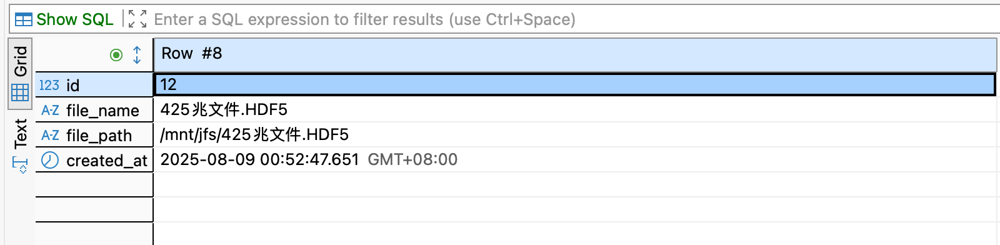
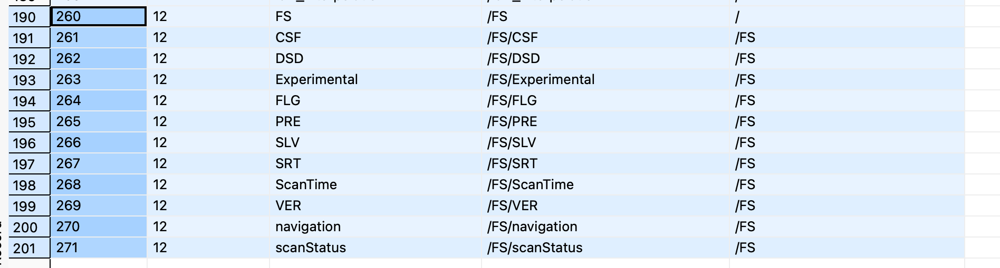
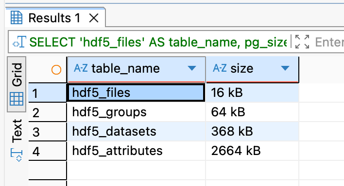
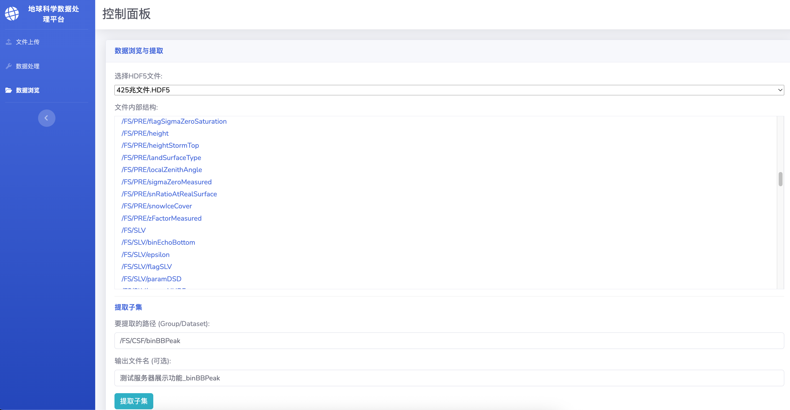
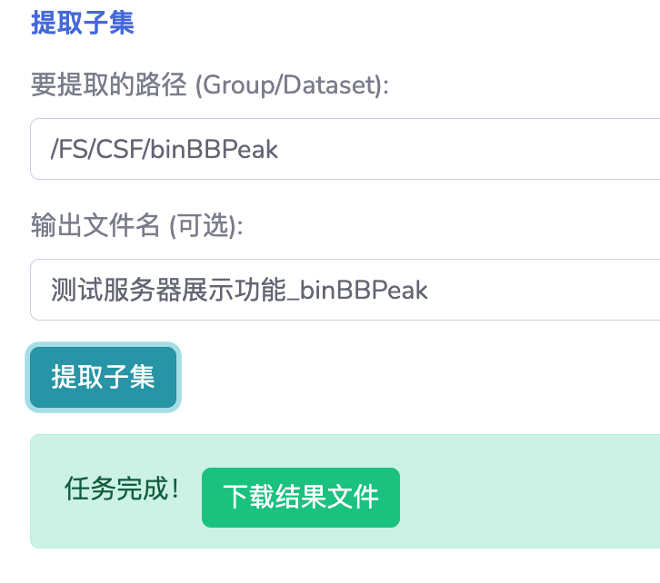
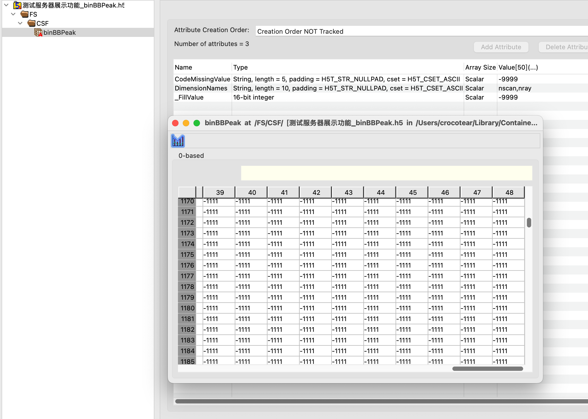
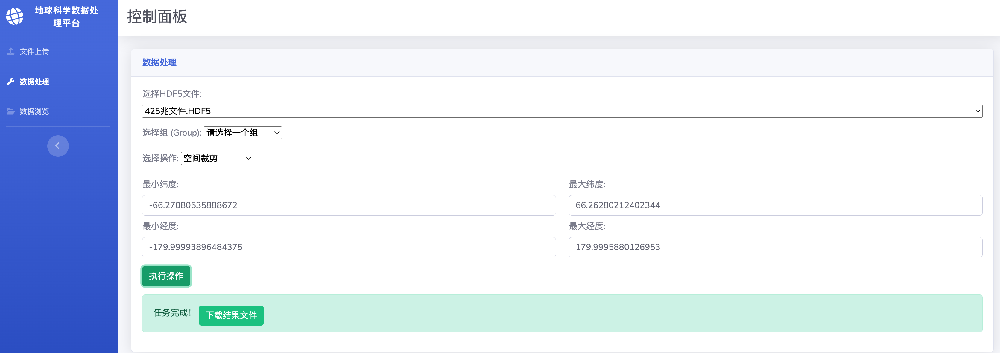
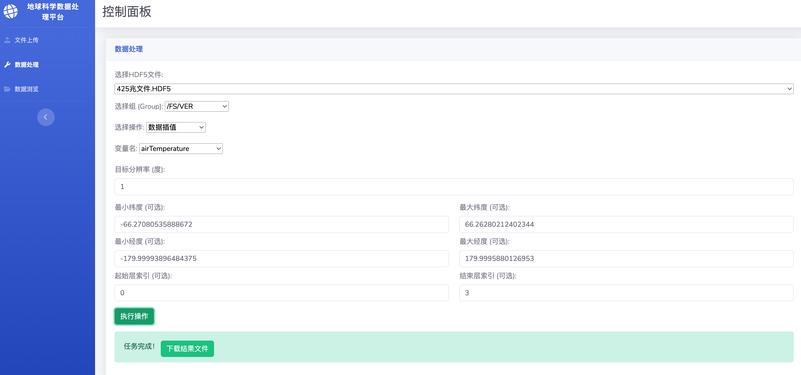

## 上传功能


服务器段juicefs内上传成功


### 调试信息

```bash
[DEBUG] 准备保存上传文件到临时路径: uploads/0cbd45fa-fc94-405e-8458-bdacf462c5d5.HDF5
[DEBUG] 文件已保存到临时路径
[DEBUG] 目标JuiceFS路径: /mnt/jfs/425兆文件.HDF5
[DEBUG] 文件已移动到JuiceFS挂载点
[DEBUG] 开始调用元数据入库函数，处理文件: /mnt/jfs/425兆文件.HDF5
[DEBUG] 连接数据库成功，开始处理文件 425兆文件.HDF5
[DEBUG] 插入文件元数据，file_id=12
[DEBUG] 访问组/数据集/属性: /AlgorithmRuntimeInfo 类型: <class 'h5py._hl.dataset.Dataset'>
[DEBUG] 访问组/数据集/属性: /FS 类型: <class 'h5py._hl.group.Group'>
[DEBUG] 访问组/数据集/属性: /FS/CSF 类型: <class 'h5py._hl.group.Group'>
[DEBUG] 访问组/数据集/属性: /FS/CSF/binBBBottom 类型: <class 'h5py._hl.dataset.Dataset'>
[DEBUG] 访问组/数据集/属性: /FS/CSF/binBBPeak 类型: <class 'h5py._hl.dataset.Dataset'>
[DEBUG] 访问组/数据集/属性: /FS/CSF/binBBTop 类型: <class 'h5py._hl.dataset.Dataset'>
[DEBUG] 访问组/数据集/属性: /FS/CSF/binHeavyIcePrecipBottom 类型: <class 'h5py._hl.dataset.Dataset'>
[DEBUG] 访问组/数据集/属性: /FS/CSF/binHeavyIcePrecipTop 类型: <class 'h5py._hl.dataset.Dataset'>
[DEBUG] 访问组/数据集/属性: /FS/CSF/flagAnvil 类型: <class 'h5py._hl.dataset.Dataset'>
[DEBUG] 访问组/数据集/属性: /FS/CSF/flagBB 类型: <class 'h5py._hl.dataset.Dataset'>
[DEBUG] 访问组/数据集/属性: /FS/CSF/flagHeavyIcePrecip 类型: <class 'h5py._hl.dataset.Dataset'>
[DEBUG] 访问组/数据集/属性: /FS/CSF/flagShallowRain 类型: <class 'h5py._hl.dataset.Dataset'>
[DEBUG] 访问组/数据集/属性: /FS/CSF/heightBB 类型: <class 'h5py._hl.dataset.Dataset'>
[DEBUG] 访问组/数据集/属性: /FS/CSF/nHeavyIcePrecip 类型: <class 'h5py._hl.dataset.Dataset'>
[DEBUG] 访问组/数据集/属性: /FS/CSF/qualityBB 类型: <class 'h5py._hl.dataset.Dataset'>
[DEBUG] 访问组/数据集/属性: /FS/CSF/qualityTypePrecip 类型: <class 'h5py._hl.dataset.Dataset'>
[DEBUG] 访问组/数据集/属性: /FS/CSF/typePrecip 类型: <class 'h5py._hl.dataset.Dataset'>
[DEBUG] 访问组/数据集/属性: /FS/CSF/widthBB 类型: <class 'h5py._hl.dataset.Dataset'>
[DEBUG] 访问组/数据集/属性: /FS/DSD 类型: <class 'h5py._hl.group.Group'>
[DEBUG] 访问组/数据集/属性: /FS/DSD/binNode 类型: <class 'h5py._hl.dataset.Dataset'>
[DEBUG] 访问组/数据集/属性: /FS/DSD/paramRDm 类型: <class 'h5py._hl.dataset.Dataset'>
[DEBUG] 访问组/数据集/属性: /FS/DSD/phase 类型: <class 'h5py._hl.dataset.Dataset'>
[DEBUG] 访问组/数据集/属性: /FS/Experimental 类型: <class 'h5py._hl.group.Group'>
[DEBUG] 访问组/数据集/属性: /FS/Experimental/precipRateESurface2 类型: <class 'h5py._hl.dataset.Dataset'>
[DEBUG] 访问组/数据集/属性: /FS/Experimental/precipRateESurface2Status 类型: <class 'h5py._hl.dataset.Dataset'>
[DEBUG] 访问组/数据集/属性: /FS/Experimental/seaIceConcentration 类型: <class 'h5py._hl.dataset.Dataset'>
[DEBUG] 访问组/数据集/属性: /FS/Experimental/sigmaZeroProfile 类型: <class 'h5py._hl.dataset.Dataset'>
[DEBUG] 访问组/数据集/属性: /FS/FLG 类型: <class 'h5py._hl.group.Group'>
[DEBUG] 访问组/数据集/属性: /FS/FLG/flagEcho 类型: <class 'h5py._hl.dataset.Dataset'>
[DEBUG] 访问组/数据集/属性: /FS/FLG/flagScanPattern 类型: <class 'h5py._hl.dataset.Dataset'>
[DEBUG] 访问组/数据集/属性: /FS/FLG/flagSensor 类型: <class 'h5py._hl.dataset.Dataset'>
[DEBUG] 访问组/数据集/属性: /FS/FLG/qualityData 类型: <class 'h5py._hl.dataset.Dataset'>
[DEBUG] 访问组/数据集/属性: /FS/FLG/qualityFlag 类型: <class 'h5py._hl.dataset.Dataset'>
[DEBUG] 访问组/数据集/属性: /FS/Latitude 类型: <class 'h5py._hl.dataset.Dataset'>
[DEBUG] 访问组/数据集/属性: /FS/Longitude 类型: <class 'h5py._hl.dataset.Dataset'>
[DEBUG] 访问组/数据集/属性: /FS/PRE 类型: <class 'h5py._hl.group.Group'>
[DEBUG] 访问组/数据集/属性: /FS/PRE/adjustFactor 类型: <class 'h5py._hl.dataset.Dataset'>
[DEBUG] 访问组/数据集/属性: /FS/PRE/binClutterFreeBottom 类型: <class 'h5py._hl.dataset.Dataset'>
[DEBUG] 访问组/数据集/属性: /FS/PRE/binMirrorImageL2 类型: <class 'h5py._hl.dataset.Dataset'>
[DEBUG] 访问组/数据集/属性: /FS/PRE/binRealSurface 类型: <class 'h5py._hl.dataset.Dataset'>
[DEBUG] 访问组/数据集/属性: /FS/PRE/binStormTop 类型: <class 'h5py._hl.dataset.Dataset'>
[DEBUG] 访问组/数据集/属性: /FS/PRE/echoCountRealSurface 类型: <class 'h5py._hl.dataset.Dataset'>
[DEBUG] 访问组/数据集/属性: /FS/PRE/elevation 类型: <class 'h5py._hl.dataset.Dataset'>
[DEBUG] 访问组/数据集/属性: /FS/PRE/ellipsoidBinOffset 类型: <class 'h5py._hl.dataset.Dataset'>
[DEBUG] 访问组/数据集/属性: /FS/PRE/flagPrecip 类型: <class 'h5py._hl.dataset.Dataset'>
[DEBUG] 访问组/数据集/属性: /FS/PRE/flagSigmaZeroSaturation 类型: <class 'h5py._hl.dataset.Dataset'>
[DEBUG] 访问组/数据集/属性: /FS/PRE/height 类型: <class 'h5py._hl.dataset.Dataset'>
[DEBUG] 访问组/数据集/属性: /FS/PRE/heightStormTop 类型: <class 'h5py._hl.dataset.Dataset'>
[DEBUG] 访问组/数据集/属性: /FS/PRE/landSurfaceType 类型: <class 'h5py._hl.dataset.Dataset'>
[DEBUG] 访问组/数据集/属性: /FS/PRE/localZenithAngle 类型: <class 'h5py._hl.dataset.Dataset'>
[DEBUG] 访问组/数据集/属性: /FS/PRE/sigmaZeroMeasured 类型: <class 'h5py._hl.dataset.Dataset'>
[DEBUG] 访问组/数据集/属性: /FS/PRE/snRatioAtRealSurface 类型: <class 'h5py._hl.dataset.Dataset'>
[DEBUG] 访问组/数据集/属性: /FS/PRE/snowIceCover 类型: <class 'h5py._hl.dataset.Dataset'>
[DEBUG] 访问组/数据集/属性: /FS/PRE/zFactorMeasured 类型: <class 'h5py._hl.dataset.Dataset'>
[DEBUG] 访问组/数据集/属性: /FS/SLV 类型: <class 'h5py._hl.group.Group'>
[DEBUG] 访问组/数据集/属性: /FS/SLV/binEchoBottom 类型: <class 'h5py._hl.dataset.Dataset'>
[DEBUG] 访问组/数据集/属性: /FS/SLV/epsilon 类型: <class 'h5py._hl.dataset.Dataset'>
[DEBUG] 访问组/数据集/属性: /FS/SLV/flagSLV 类型: <class 'h5py._hl.dataset.Dataset'>
[DEBUG] 访问组/数据集/属性: /FS/SLV/paramDSD 类型: <class 'h5py._hl.dataset.Dataset'>
[DEBUG] 访问组/数据集/属性: /FS/SLV/paramNUBF 类型: <class 'h5py._hl.dataset.Dataset'>
[DEBUG] 访问组/数据集/属性: /FS/SLV/phaseNearSurface 类型: <class 'h5py._hl.dataset.Dataset'>
[DEBUG] 访问组/数据集/属性: /FS/SLV/piaFinal 类型: <class 'h5py._hl.dataset.Dataset'>
[DEBUG] 访问组/数据集/属性: /FS/SLV/piaOffset 类型: <class 'h5py._hl.dataset.Dataset'>
[DEBUG] 访问组/数据集/属性: /FS/SLV/precipRate 类型: <class 'h5py._hl.dataset.Dataset'>
[DEBUG] 访问组/数据集/属性: /FS/SLV/precipRateAve24 类型: <class 'h5py._hl.dataset.Dataset'>
[DEBUG] 访问组/数据集/属性: /FS/SLV/precipRateESurface 类型: <class 'h5py._hl.dataset.Dataset'>
[DEBUG] 访问组/数据集/属性: /FS/SLV/precipRateNearSurface 类型: <class 'h5py._hl.dataset.Dataset'>
[DEBUG] 访问组/数据集/属性: /FS/SLV/precipWater 类型: <class 'h5py._hl.dataset.Dataset'>
[DEBUG] 访问组/数据集/属性: /FS/SLV/precipWaterIntegrated 类型: <class 'h5py._hl.dataset.Dataset'>
[DEBUG] 访问组/数据集/属性: /FS/SLV/qualitySLV 类型: <class 'h5py._hl.dataset.Dataset'>
[DEBUG] 访问组/数据集/属性: /FS/SLV/sigmaZeroCorrected 类型: <class 'h5py._hl.dataset.Dataset'>
[DEBUG] 访问组/数据集/属性: /FS/SLV/zFactorFinal 类型: <class 'h5py._hl.dataset.Dataset'>
[DEBUG] 访问组/数据集/属性: /FS/SLV/zFactorFinalESurface 类型: <class 'h5py._hl.dataset.Dataset'>
[DEBUG] 访问组/数据集/属性: /FS/SLV/zFactorFinalNearSurface 类型: <class 'h5py._hl.dataset.Dataset'>
[DEBUG] 访问组/数据集/属性: /FS/SRT 类型: <class 'h5py._hl.group.Group'>
[DEBUG] 访问组/数据集/属性: /FS/SRT/PIAalt 类型: <class 'h5py._hl.dataset.Dataset'>
[DEBUG] 访问组/数据集/属性: /FS/SRT/PIAhb 类型: <class 'h5py._hl.dataset.Dataset'>
[DEBUG] 访问组/数据集/属性: /FS/SRT/PIAhybrid 类型: <class 'h5py._hl.dataset.Dataset'>
[DEBUG] 访问组/数据集/属性: /FS/SRT/PIAweight 类型: <class 'h5py._hl.dataset.Dataset'>
[DEBUG] 访问组/数据集/属性: /FS/SRT/PIAweightHY 类型: <class 'h5py._hl.dataset.Dataset'>
[DEBUG] 访问组/数据集/属性: /FS/SRT/RFactorAlt 类型: <class 'h5py._hl.dataset.Dataset'>
[DEBUG] 访问组/数据集/属性: /FS/SRT/pathAtten 类型: <class 'h5py._hl.dataset.Dataset'>
[DEBUG] 访问组/数据集/属性: /FS/SRT/refScanID 类型: <class 'h5py._hl.dataset.Dataset'>
[DEBUG] 访问组/数据集/属性: /FS/SRT/reliabFactor 类型: <class 'h5py._hl.dataset.Dataset'>
[DEBUG] 访问组/数据集/属性: /FS/SRT/reliabFactorHY 类型: <class 'h5py._hl.dataset.Dataset'>
[DEBUG] 访问组/数据集/属性: /FS/SRT/reliabFlag 类型: <class 'h5py._hl.dataset.Dataset'>
[DEBUG] 访问组/数据集/属性: /FS/SRT/reliabFlagHY 类型: <class 'h5py._hl.dataset.Dataset'>
[DEBUG] 访问组/数据集/属性: /FS/SRT/stddevEff 类型: <class 'h5py._hl.dataset.Dataset'>
[DEBUG] 访问组/数据集/属性: /FS/SRT/stddevHY 类型: <class 'h5py._hl.dataset.Dataset'>
[DEBUG] 访问组/数据集/属性: /FS/SRT/zeta 类型: <class 'h5py._hl.dataset.Dataset'>
[DEBUG] 访问组/数据集/属性: /FS/ScanTime 类型: <class 'h5py._hl.group.Group'>
[DEBUG] 访问组/数据集/属性: /FS/ScanTime/DayOfMonth 类型: <class 'h5py._hl.dataset.Dataset'>
[DEBUG] 访问组/数据集/属性: /FS/ScanTime/DayOfYear 类型: <class 'h5py._hl.dataset.Dataset'>
[DEBUG] 访问组/数据集/属性: /FS/ScanTime/Hour 类型: <class 'h5py._hl.dataset.Dataset'>
[DEBUG] 访问组/数据集/属性: /FS/ScanTime/MilliSecond 类型: <class 'h5py._hl.dataset.Dataset'>
[DEBUG] 访问组/数据集/属性: /FS/ScanTime/Minute 类型: <class 'h5py._hl.dataset.Dataset'>
[DEBUG] 访问组/数据集/属性: /FS/ScanTime/Month 类型: <class 'h5py._hl.dataset.Dataset'>
[DEBUG] 访问组/数据集/属性: /FS/ScanTime/Second 类型: <class 'h5py._hl.dataset.Dataset'>
[DEBUG] 访问组/数据集/属性: /FS/ScanTime/SecondOfDay 类型: <class 'h5py._hl.dataset.Dataset'>
[DEBUG] 访问组/数据集/属性: /FS/ScanTime/Year 类型: <class 'h5py._hl.dataset.Dataset'>
[DEBUG] 访问组/数据集/属性: /FS/VER 类型: <class 'h5py._hl.group.Group'>
[DEBUG] 访问组/数据集/属性: /FS/VER/airTemperature 类型: <class 'h5py._hl.dataset.Dataset'>
[DEBUG] 访问组/数据集/属性: /FS/VER/attenuationNP 类型: <class 'h5py._hl.dataset.Dataset'>
[DEBUG] 访问组/数据集/属性: /FS/VER/binZeroDeg 类型: <class 'h5py._hl.dataset.Dataset'>
[DEBUG] 访问组/数据集/属性: /FS/VER/binZeroDegSecondary 类型: <class 'h5py._hl.dataset.Dataset'>
[DEBUG] 访问组/数据集/属性: /FS/VER/flagInversion 类型: <class 'h5py._hl.dataset.Dataset'>
[DEBUG] 访问组/数据集/属性: /FS/VER/heightZeroDeg 类型: <class 'h5py._hl.dataset.Dataset'>
[DEBUG] 访问组/数据集/属性: /FS/VER/piaNP 类型: <class 'h5py._hl.dataset.Dataset'>
[DEBUG] 访问组/数据集/属性: /FS/VER/piaNPrainFree 类型: <class 'h5py._hl.dataset.Dataset'>
[DEBUG] 访问组/数据集/属性: /FS/VER/sigmaZeroNPCorrected 类型: <class 'h5py._hl.dataset.Dataset'>
[DEBUG] 访问组/数据集/属性: /FS/navigation 类型: <class 'h5py._hl.group.Group'>
[DEBUG] 访问组/数据集/属性: /FS/navigation/dprAlt 类型: <class 'h5py._hl.dataset.Dataset'>
[DEBUG] 访问组/数据集/属性: /FS/navigation/greenHourAng 类型: <class 'h5py._hl.dataset.Dataset'>
[DEBUG] 访问组/数据集/属性: /FS/navigation/scAlt 类型: <class 'h5py._hl.dataset.Dataset'>
[DEBUG] 访问组/数据集/属性: /FS/navigation/scAttPitchGeoc 类型: <class 'h5py._hl.dataset.Dataset'>
[DEBUG] 访问组/数据集/属性: /FS/navigation/scAttPitchGeod 类型: <class 'h5py._hl.dataset.Dataset'>
[DEBUG] 访问组/数据集/属性: /FS/navigation/scAttRollGeoc 类型: <class 'h5py._hl.dataset.Dataset'>
[DEBUG] 访问组/数据集/属性: /FS/navigation/scAttRollGeod 类型: <class 'h5py._hl.dataset.Dataset'>
[DEBUG] 访问组/数据集/属性: /FS/navigation/scAttYawGeoc 类型: <class 'h5py._hl.dataset.Dataset'>
[DEBUG] 访问组/数据集/属性: /FS/navigation/scAttYawGeod 类型: <class 'h5py._hl.dataset.Dataset'>
[DEBUG] 访问组/数据集/属性: /FS/navigation/scHeadingGround 类型: <class 'h5py._hl.dataset.Dataset'>
[DEBUG] 访问组/数据集/属性: /FS/navigation/scHeadingOrbital 类型: <class 'h5py._hl.dataset.Dataset'>
[DEBUG] 访问组/数据集/属性: /FS/navigation/scLat 类型: <class 'h5py._hl.dataset.Dataset'>
[DEBUG] 访问组/数据集/属性: /FS/navigation/scLon 类型: <class 'h5py._hl.dataset.Dataset'>
[DEBUG] 访问组/数据集/属性: /FS/navigation/scPos 类型: <class 'h5py._hl.dataset.Dataset'>
[DEBUG] 访问组/数据集/属性: /FS/navigation/scVel 类型: <class 'h5py._hl.dataset.Dataset'>
[DEBUG] 访问组/数据集/属性: /FS/navigation/timeMidScan 类型: <class 'h5py._hl.dataset.Dataset'>
[DEBUG] 访问组/数据集/属性: /FS/navigation/timeMidScanOffset 类型: <class 'h5py._hl.dataset.Dataset'>
[DEBUG] 访问组/数据集/属性: /FS/scanStatus 类型: <class 'h5py._hl.group.Group'>
[DEBUG] 访问组/数据集/属性: /FS/scanStatus/FractionalGranuleNumber 类型: <class 'h5py._hl.dataset.Dataset'>
[DEBUG] 访问组/数据集/属性: /FS/scanStatus/SCorientation 类型: <class 'h5py._hl.dataset.Dataset'>
[DEBUG] 访问组/数据集/属性: /FS/scanStatus/acsModeMidScan 类型: <class 'h5py._hl.dataset.Dataset'>
[DEBUG] 访问组/数据集/属性: /FS/scanStatus/dataQuality 类型: <class 'h5py._hl.dataset.Dataset'>
[DEBUG] 访问组/数据集/属性: /FS/scanStatus/dataWarning 类型: <class 'h5py._hl.dataset.Dataset'>
[DEBUG] 访问组/数据集/属性: /FS/scanStatus/geoError 类型: <class 'h5py._hl.dataset.Dataset'>
[DEBUG] 访问组/数据集/属性: /FS/scanStatus/geoWarning 类型: <class 'h5py._hl.dataset.Dataset'>
[DEBUG] 访问组/数据集/属性: /FS/scanStatus/limitErrorFlag 类型: <class 'h5py._hl.dataset.Dataset'>
[DEBUG] 访问组/数据集/属性: /FS/scanStatus/missing 类型: <class 'h5py._hl.dataset.Dataset'>
[DEBUG] 访问组/数据集/属性: /FS/scanStatus/modeStatus 类型: <class 'h5py._hl.dataset.Dataset'>
[DEBUG] 访问组/数据集/属性: /FS/scanStatus/operationalMode 类型: <class 'h5py._hl.dataset.Dataset'>
[DEBUG] 访问组/数据集/属性: /FS/scanStatus/pointingStatus 类型: <class 'h5py._hl.dataset.Dataset'>
[DEBUG] 访问组/数据集/属性: /FS/scanStatus/targetSelectionMidScan 类型: <class 'h5py._hl.dataset.Dataset'>
[DEBUG] 访问组/数据集/属性: /FS/sunLocalTime 类型: <class 'h5py._hl.dataset.Dataset'>
[DEBUG] 元数据入库成功，文件ID: 12
```

数据库验证成功（hdf5_files）



对应group（hdf5_groups）



潜在问题：随着层级深入，表越来越大

```sql
SELECT 'hdf5_files' AS table_name, pg_size_pretty(pg_table_size('hdf5_files')) AS size
UNION ALL
SELECT 'hdf5_groups', pg_size_pretty(pg_table_size('hdf5_groups'))
UNION ALL
SELECT 'hdf5_datasets', pg_size_pretty(pg_table_size('hdf5_datasets'))
UNION ALL
SELECT 'hdf5_attributes', pg_size_pretty(pg_table_size('hdf5_attributes'));
```



## 展示功能（read）

### 选择数据集并下载






### 查看内容



## 空间裁剪

```bash
[WORKER] 开始执行任务: 2a87dc15-44a1-4e9f-9c10-98d96a06b3ae
成功连接到数据库 'juicefs'。
正在数据库中查找文件: 425兆文件.HDF5...
找到文件记录: ID=12, Path='/mnt/jfs/425兆文件.HDF5'
推断出纬度变量: 'Latitude', 组: '/FS'
推断出经度变量: 'Longitude'
假设数据组与经纬度组相同: '/FS'
准备执行裁剪...
  输入: /mnt/jfs/425兆文件.HDF5
  输出: out/425兆文件_cropped_20250809015041.h5
  范围: Lat(-66.27080535888672, 66.26280212402344), Lon(-179.99993896484375, 179.9995880126953)
2025-08-09 01:50:41,318 - INFO - 裁剪范围: 纬度 -66.27080535888672°N-66.26280212402344°N, 经度 -179.99993896484375°E-179.9995880126953°E
2025-08-09 01:50:41,356 - INFO - 已复制组的 5 个属性
2025-08-09 01:50:41,356 - INFO - 已复制根级别的 5 个属性
2025-08-09 01:50:41,356 - INFO - 创建组: FS
2025-08-09 01:50:41,356 - INFO - 已复制组的 1 个属性
2025-08-09 01:50:41,385 - INFO - 经纬度数据形状: lat=(7934, 49), lon=(7934, 49)
2025-08-09 01:50:41,387 - INFO - 文件的有效纬度范围: -66.27080535888672°N - 66.26280212402344°N
2025-08-09 01:50:41,388 - INFO - 文件的有效经度范围: -179.99993896484375°E - 179.9995880126953°E
2025-08-09 01:50:41,411 - INFO - 裁剪后纬度点数: 7934, 经度点数: 49
2025-08-09 01:50:41,450 - INFO - 已复制纬度变量 'Latitude' 的 5 个属性
2025-08-09 01:50:41,450 - INFO - 已复制经度变量 'Longitude' 的 5 个属性
2025-08-09 01:50:41,506 - INFO - 处理数据集 'sunLocalTime', 形状: (7934, 49)
2025-08-09 01:50:41,521 - INFO - 成功处理数据集 'sunLocalTime', 裁剪后形状: (7934, 49)
2025-08-09 01:50:41,541 - INFO - 已复制数据集 'sunLocalTime' 的 5 个属性
2025-08-09 01:50:41,574 - INFO - 处理完成! 总数据集数: 1, 成功: 1, 跳过: 0
裁剪成功完成！
[WORKER] 任务 2a87dc15-44a1-4e9f-9c10-98d96a06b3ae 完成，结果: /root/challenger-cup-fs-main/out/425兆文件_cropped_20250809015041.h5
```



## 空间插值

```bash
[WORKER] 开始执行任务: 63f2726f-974a-4542-ba48-e88d962bcf0f
准备执行插值任务...
  输入文件: /mnt/jfs/425兆文件.HDF5
  变量名: airTemperature
  分辨率: 1.0
  经纬度范围: Lon(-179.99993896484375, 179.9995880126953), Lat(-66.27080535888672, 66.26280212402344)
  层范围: Layer(0, 3)
[INFO] DB Paths: file='/mnt/jfs/425兆文件.HDF5', data='/FS/VER/airTemperature', lat='/FS/Latitude', lon='/FS/Longitude'
读取文件: /mnt/jfs/425兆文件.HDF5
预处理数据...
116.169.81.54 - - [09/Aug/2025 01:48:38] "GET /api/status/63f2726f-974a-4542-ba48-e88d962bcf0f HTTP/1.1" 200 -
三维变量层范围过滤：保留第0至3层，共4层
预处理耗时: 0.25秒
插值网格规模: 360x133 = 47,880点
总进度:   0%|                                             | 0/4 [00:00<?, ?it/s]\n===== 插值层 1 =====
/usr/local/lib/python3.6/site-packages/joblib/parallel.py:739: UserWarning: Loky-backed parallel loops cannot be called in a multiprocessing, setting n_jobs=1
  **self._backend_args)
[Parallel(n_jobs=-1)]: Using backend SequentialBackend with 1 concurrent workers.
[Parallel(n_jobs=-1)]: Done   1 out of   1 | elapsed:    0.0s remaining:    0.0s
[Parallel(n_jobs=-1)]: Done   2 out of   2 | elapsed:    0.2s remaining:    0.0s
[Parallel(n_jobs=-1)]: Done   3 out of   3 | elapsed:    0.3s remaining:    0.0s
[Parallel(n_jobs=-1)]: Done   4 out of   4 | elapsed:    0.4s remaining:    0.0s
[Parallel(n_jobs=-1)]: Done   8 out of   8 | elapsed:    0.5s finished
层 1 完成，耗时: 0.51秒，覆盖率: 3.34%
总进度:  25%|█████████▎                           | 1/4 [00:00<00:01,  1.96it/s]\n===== 插值层 2 =====
[Parallel(n_jobs=-1)]: Using backend SequentialBackend with 1 concurrent workers.
[Parallel(n_jobs=-1)]: Done   1 out of   1 | elapsed:    0.0s remaining:    0.0s
[Parallel(n_jobs=-1)]: Done   2 out of   2 | elapsed:    0.2s remaining:    0.0s
[Parallel(n_jobs=-1)]: Done   3 out of   3 | elapsed:    0.3s remaining:    0.0s
[Parallel(n_jobs=-1)]: Done   4 out of   4 | elapsed:    0.4s remaining:    0.0s
[Parallel(n_jobs=-1)]: Done   8 out of   8 | elapsed:    0.5s finished
层 2 完成，耗时: 0.51秒，覆盖率: 3.34%
总进度:  50%|██████████████████▌                  | 2/4 [00:01<00:01,  1.96it/s]\n===== 插值层 3 =====
[Parallel(n_jobs=-1)]: Using backend SequentialBackend with 1 concurrent workers.
[Parallel(n_jobs=-1)]: Done   1 out of   1 | elapsed:    0.0s remaining:    0.0s
[Parallel(n_jobs=-1)]: Done   2 out of   2 | elapsed:    0.2s remaining:    0.0s
[Parallel(n_jobs=-1)]: Done   3 out of   3 | elapsed:    0.3s remaining:    0.0s
[Parallel(n_jobs=-1)]: Done   4 out of   4 | elapsed:    0.4s remaining:    0.0s
[Parallel(n_jobs=-1)]: Done   8 out of   8 | elapsed:    0.5s finished
层 3 完成，耗时: 0.51秒，覆盖率: 3.34%
总进度:  75%|███████████████████████████▊         | 3/4 [00:01<00:00,  1.95it/s]\n===== 插值层 4 =====
[Parallel(n_jobs=-1)]: Using backend SequentialBackend with 1 concurrent workers.
[Parallel(n_jobs=-1)]: Done   1 out of   1 | elapsed:    0.0s remaining:    0.0s
[Parallel(n_jobs=-1)]: Done   2 out of   2 | elapsed:    0.2s remaining:    0.0s
[Parallel(n_jobs=-1)]: Done   3 out of   3 | elapsed:    0.3s remaining:    0.0s
[Parallel(n_jobs=-1)]: Done   4 out of   4 | elapsed:    0.4s remaining:    0.0s
[Parallel(n_jobs=-1)]: Done   8 out of   8 | elapsed:    0.5s finished
层 4 完成，耗时: 0.51秒，覆盖率: 3.34%
总进度: 100%|█████████████████████████████████████| 4/4 [00:02<00:00,  1.95it/s]
保存结果到: out/425兆文件_airTemperature_interpolated.h5

============================================================
                  插值完成报告
============================================================
变量名: airTemperature
原始维度: 3D，处理层数: 4
层范围: 0至3
总覆盖率: 3.34%
结果文件: out/425兆文件_airTemperature_interpolated.h5
============================================================

总耗时: 4.40秒
插值成功完成！结果保存到: out/425兆文件_airTemperature_interpolated.h5
[WORKER] 任务 63f2726f-974a-4542-ba48-e88d962bcf0f 完成，结果: /root/challenger-cup-fs-main/out/425兆文件_airTemperature_interpolated.h5
```


